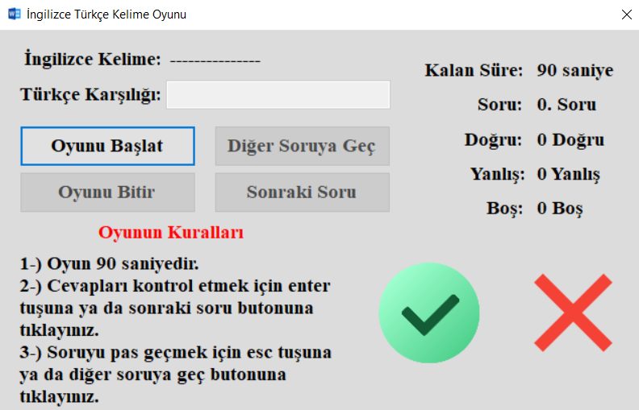
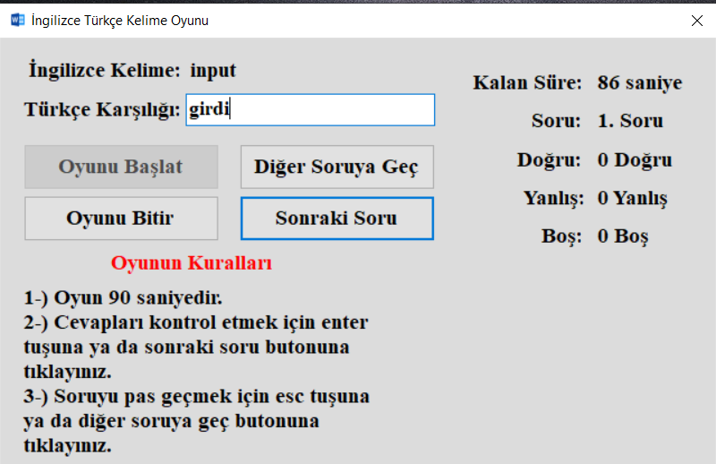
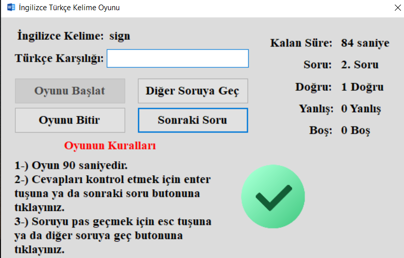
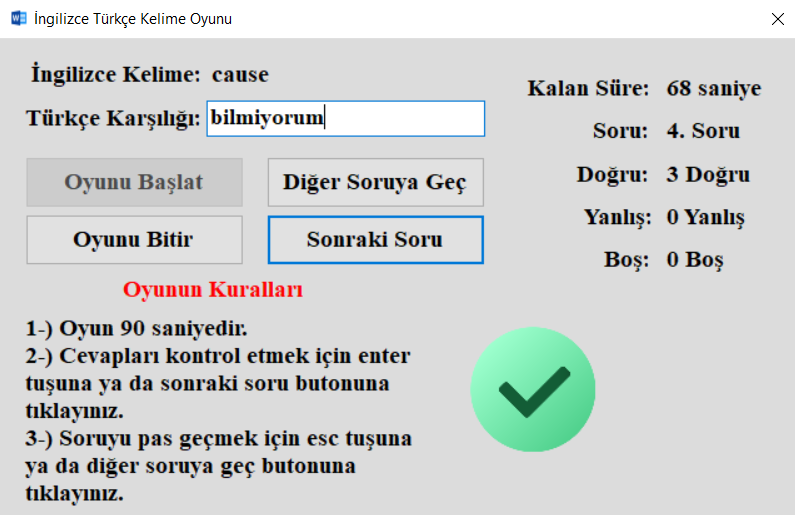
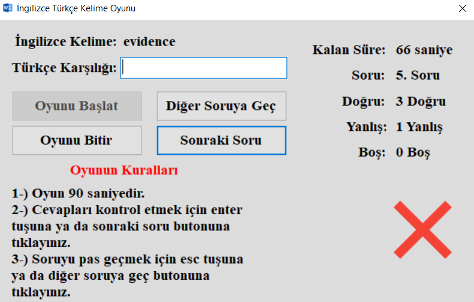
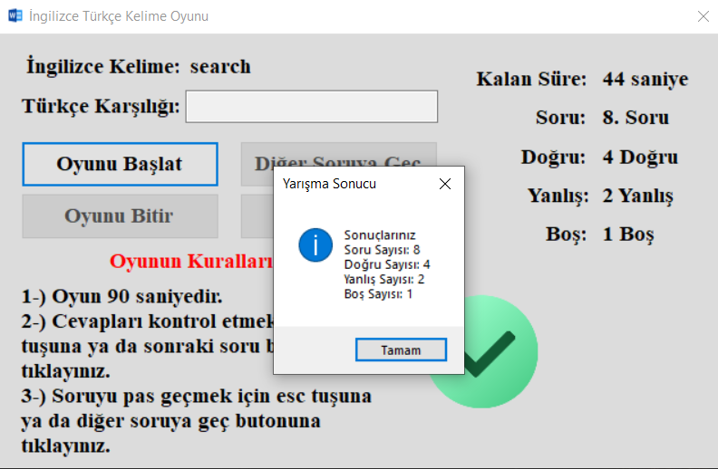
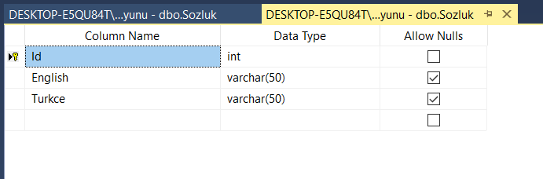
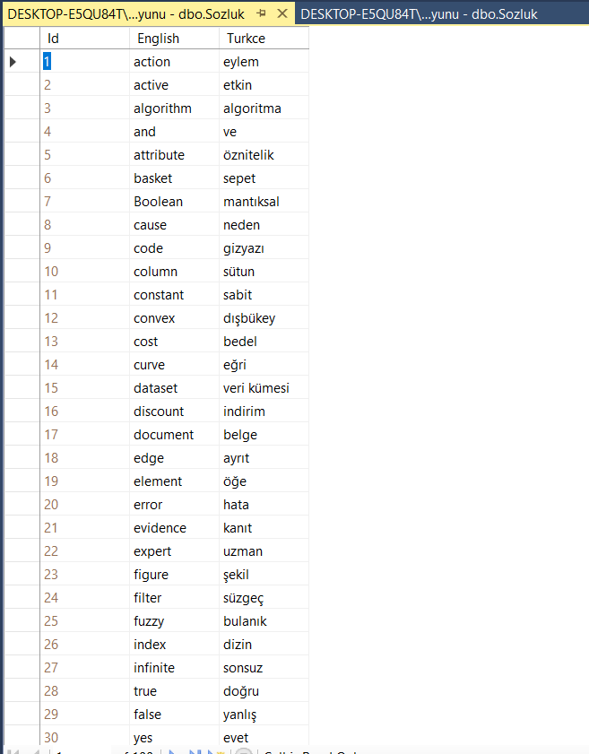
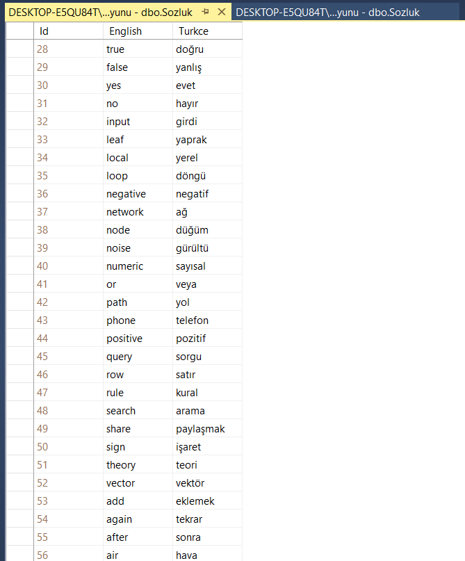

# 01_IngilizceTurkceKelimeOyunu Projesi

* Bu projemizde SQL ve C# kullanarak zamana karşı basit bir İngilizce Türkçe çeviri oyununu Windows Forms App (.NET Framework) ile projemi gerçekleştirdim.

* Yapacağımız işlemler oyun başladıktan sonra çıkan İngilizce kelimeleri veri tabanında kayıtlı olan Türkçe karşılıklarına göre eşleştirmektir. Eğer kullanıcı doğru bilirse ona göre ayrı işlemler, yanlış bilirse ona göre ayrı işlemler veya pas geçerse ona göre ayrı işlemler yapılacaktır. Tabi bu işlemler belli bir süre ile kısıtlı olacak.

## Aşağıdaki resimde projemizin açılış sayfası gösterilmektedir.

## Eğer kullanıcı çıkan kelimeyi doğru bilirse doğru olduğunu göstermek için yeşil resim çıkar ve yeni soruya geçer.

* Kullanıcı input İngilizce kelimesinin Türkçe karşılığını girdi olarak yazar ve enter tuşuna basar. 

* Cevap doğru olduğu için yeşil ikon çıktı, doğru sayısını arttırdı ve yeni soruya doğrudan geçti.

## Eğer kullanıcı çıkan kelimeyi yanlış bilirse yanlış olduğunu göstermek için kırmızı resim çıkar ve yeni soruya geçer.

* Kullanıcı cause İngilizce kelimesinin Türkçe karşılığını bilmiyorum olarak yazar ve enter tuşuna basar. 

* Cevap yanlış olduğu için (cause = neden, sebep) kırmızı ikon çıktı, yanlış sayısını arttırdı ve yeni soruya doğrudan geçti.

* Arada diğer soruya geç butonuna tıklanıldığı için veya esc tuşuna basıldığı için boş soru sayıları da artar ve yeni kelime getirir.

## Oyun bitirilir veya süre biterse çıkan mesaj görüntüsü aşağıdaki resimde gösterilmektedir.

* Burada soru sayısını bir fazla yazdırmışız siz kodları kullanırken oradaki hatayı isterseniz düzeltebilirsiniz.

## SQL TABLOSU

* SQL tablosundaki verileri paylaşmak yerine sizin kendi SQL Server'ınızda oluşturmanız daha iyi olur.

* İlk olarak veri tabanımızın sutünları oluşturulur ve tutacağı veri tipleri belirlenir ve kaydedilir.

* Daha sonra oluşturduğumuz tablonun içerisine veri girişleri yapıldı.

* Kelimeler yanlış ise değiştirmeyi unutmayın.

* Sizler buradaki veri girişini arttırabilirsiniz.

## Önemli Noktaları Açıklayalım

* İlk olarak veri tabanından rasgele soru getirmek için random sınıfını kullandım ve daha sonra veri tabanı bağlantı adresini tanımladım.

~~~ C#
Random rnd = new Random();
SqlConnection baglanti = new SqlConnection("Data Source=DESKTOP-E5QU84T\\SQLEXPRESS;Initial Catalog=CeviriOyunu;Integrated Security=True");
~~~

* Daha sonra veri tabanından kelimeleri getirmek için **SoruuGetir()** parametreli metodunu oluşturdum. Buradaki parametre üretilen rasgele sayılardan oluşuyor ve aynı id'ye göre soru getiriyor. Daha önceden tanımlanmış kelime ve dogruCevap değişkenlerine uygun değerler tanımlanıyor ve soru getirme işlemlerimiz son buluyor.

~~~ C#
void SoruGetir(int id)
{
    baglanti.Open();
    SqlCommand komut = new SqlCommand("Select * From Sozluk where Id = @p1", baglanti);
    komut.Parameters.AddWithValue("@p1", id);
    SqlDataReader oku = komut.ExecuteReader();
    while (oku.Read())
    {
        kelime = oku[1].ToString().ToLower();
        dogruCevap = oku[2].ToString().ToLower();
    }
    baglanti.Close();
}
~~~